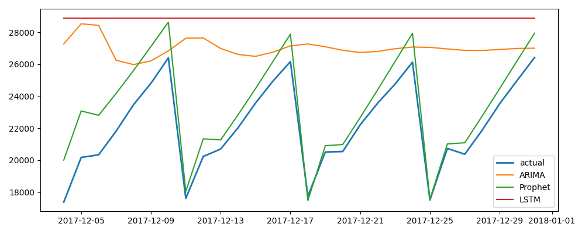

# Comparación de modelos

Periodo de prueba: 2017-12-04 - 2017-12-31

## ARIMA
```{'MAE': 4845.1947933397605, 'RMSE': 5709.59326877043, 'MAPE': 23.97216104318178}```

## Prophet
```{'MAE': 1251.18831219333, 'RMSE': 1490.0022555775524, 'MAPE': 5.593382495708703}```

## LSTM
```{'MAE': 6728.607142857142, 'RMSE': 7273.045462598209, 'MAPE': 32.47315426516133}```


